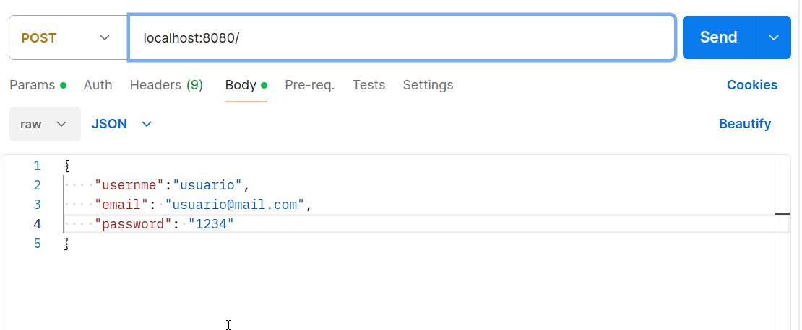

# Proyecto CRUD con Mongoose

Este es un proyecto básico que utiliza Mongoose para realizar operaciones CRUD (Crear, Leer, Actualizar, Eliminar) en una base de datos MongoDB. 

El objetivo es que aprendas a seguir un paso a paso.

NO copies y pegues el código. Haz cada paso entendiéndolo y sabiendo que hace cada parte del código.
Usa internet para encontrar respuestas si algo no funciona o tienes alguna duda referente.

## Índice

- [Paso 0: Crear una base de datos en Mongo Atlas](#paso-0-crear-una-base-de-datos-en-mongo-atlas)
    - [Guía en PDF](assets/MongoDBAtlas.pdf)
- [Paso 1: Crear un Servidor Express](#paso-1-crear-un-servidor-express)
- [Paso 2: Conexión DB](#paso-2-conexión-db)
- [Paso 3: Modelo User](#paso-3-modelo-user)
- [Paso 4: Rutas y endpoints](#paso-4-rutas-y-endpoints)
- [Referencias](#referencias)

## Paso 0: Crear una base de datos en Mongo Atlas

Para poder realizar este proyecto necesitamos una base de datos en Mongo Atlas. Para ello nos dirigimos a la página de Mongo Atlas y creamos una cuenta. 
 https://www.mongodb.com/atlas/database

Una vez creada la cuenta, creamos un nuevo proyecto y dentro de él una nueva base de datos.

Una vez creada la base de datos, obtenemos la url de conexión y la guardamos en un archivo .env en la raíz del proyecto.

Podéis usar el pdf que se encuentra en la carpeta de assets para ver como se hace. Para poder verlo directamente desde visual studio code, podéis instalar la extensión `vscode-pdf` y abrir el archivo.

```
// .env
MONGO_URL = <url de conexión>
```

## Paso 1: Crear un Servidor Express

Lo primero creamos un servidor de express y lo levantamos.

Para ello inicializamos proyecto de node e instalamos dependencias:

Terminal

```bash
npm init -y
npm i express mongoose dotenv

```
Instalamos express para crear el servidor, mongoose para la conexión a la base de datos y dotenv para poder usar las variables de entorno.


Código Servidor
```js
// index.js
const express = require('express');
const app = express();
const PORT = 8080;

app.listen(PORT, () => console.log(`Server started on port ${PORT}`));
```

## Paso 2: Conexión DB
Después creamos la conexión de la base de datos a Mongo Atlas.
Para ello un archivo .env que contiene url con la conexión a Mongo Atlas. Después creamos la carpeta config y dentro de ello el archivo config.js con el código que necesitamos para la coneción a la base de datos.

Luego nos importaremos dicha conexión en index.js y llamamos la función para que cuando levantemos el servidor haga la conexión.

```js
// index.js ahora
const express = require('express');
const app = express();
const PORT = 8080;
const { dbConnection } = require('./config/config');

dbConnection();

app.listen(PORT, () => console.log(`Server started on port ${PORT}`));
```
    
```js
// ./config/config.js
const mongoose = require('mongoose');
require('dotenv').config();

const dbConnection = async() => {
    try {
        console.log(process.env.MONGO_URI);
        await mongoose.connect(process.env.MONGO_URI);
        console.log('Base de datos conectada con éxito');
    } catch (error) {
        console.error(error);
        throw new Error('Error a la hora de iniciar la base de datos');
    }
};

module.exports = {
    dbConnection,
};
```


## Paso 3: Modelo User
Después creamos el modelo del usuario. Esto permite que podamos realizar operaciones en la base de datos MongoDB relacionadas con la colección de usuarios. Para ello creamos una carpeta models y dentro crearemos nuestros modelos.
En este caso creamos un archivo llamado User.js que contendrá nuestro modelo de User.
De esta forma tendremos una estructura que nos permitirá el uso de operaciones CRUD (Create, Read, Update, Delete) que pueden realizarse en la base de datos.

```js
// User.js

const mongoose = require('mongoose');

const UserSchema = new mongoose.Schema({
    username: String,
    email: String,
    password: String,
}, { timestamps: true });

const User = mongoose.model('User', UserSchema);

module.exports = User;
```

## Paso 4: Rutas y endpoints
Por último crearemos las rutas y en ellas los diferentes endpoints(CRUD).

Para ello creamos la carpeta routes y en ella el archivo users.js que hiremos completando con los diferentes endpoints:

Ejemplo para el endpoint de crear un usuario nuevo:

```js
// users.js

const express = require("express");
const router = express.Router();
const User = require("../models/User.js"); 


router.post("/create", async(req, res) => {
    try {
        const user = await User.create(req.body);
        res.status(201).send(user);
    } catch (error) {
        console.error(error);
        res
            .status(500)
            .send({ message: "There was a problem trying to create a user" });
    }
});

module.exports = router;
```
Después en la carpeta de routes creamos el archivo index.js con el siguiente codígo:

```js
// routes/index.js

const express = require('express');
const router = express.Router();
const usersRoutes = require('./users');

router.use('/', usersRoutes);

module.exports = router;
```
Por último nos importamos las rutas en nuestro archivo principal index.js, añadimos el express JSON para parsear el body, y añadimos la ruta:

```js
// index.js

const express = require('express');
const app = express();
const PORT = 8080;
const { dbConnection } = require('./config/config');
const routes = require('./routes');

app.use(express.json());

app.use('/', routes);

dbConnection();

app.listen(PORT, () => console.log(`Server started on port ${PORT}`));
```

Con esto ya tendríamos un servidor de express con una conexión a una base de datos MongoDB y con operaciones CRUD para la colección de usuarios. Para poder probarlo podemos usar Postman o cualquier otra herramienta que nos permita hacer peticiones HTTP.



## Referencias
- [Mongo Atlas](https://www.mongodb.com/atlas/database)
- [Mongoose](https://mongoosejs.com/)
    - [Modelos](https://mongoosejs.com/docs/models.html)
    - [Schemas](https://mongoosejs.com/docs/guide.html)
    - [Queries](https://mongoosejs.com/docs/queries.html)
- [Express](https://expressjs.com/)
- [dotenv](https://www.npmjs.com/package/dotenv)
- [CRUD](https://en.wikipedia.org/wiki/Create,_read,_update_and_delete)